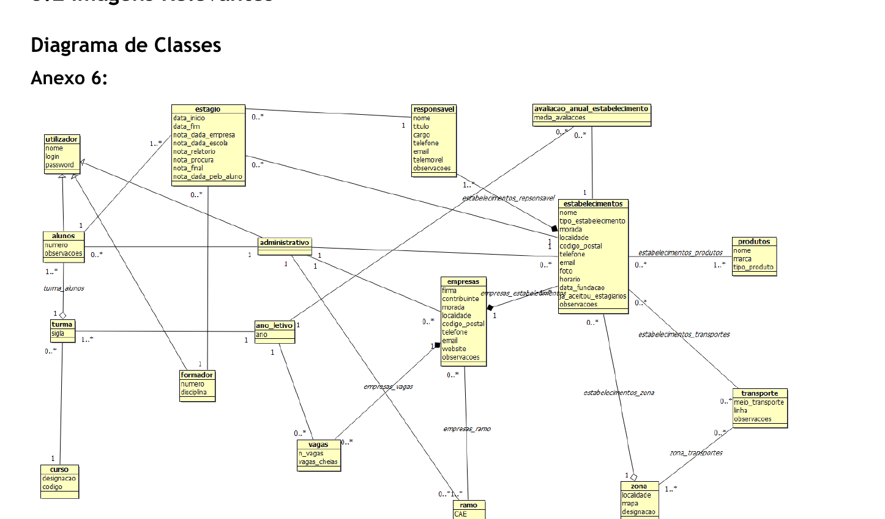
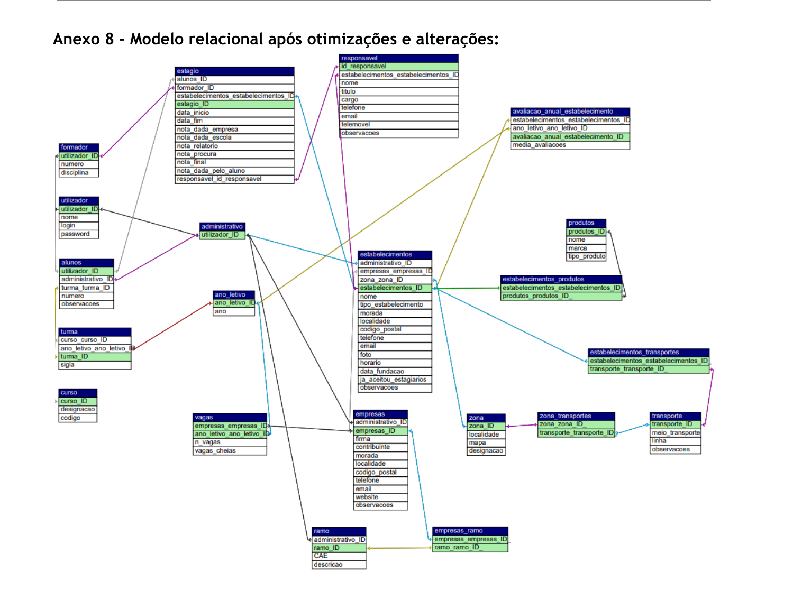
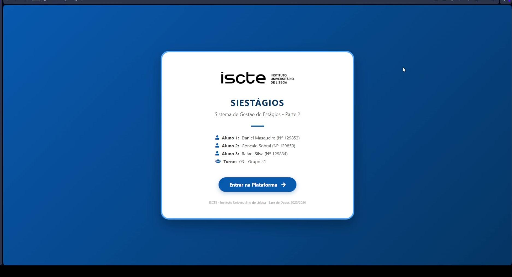
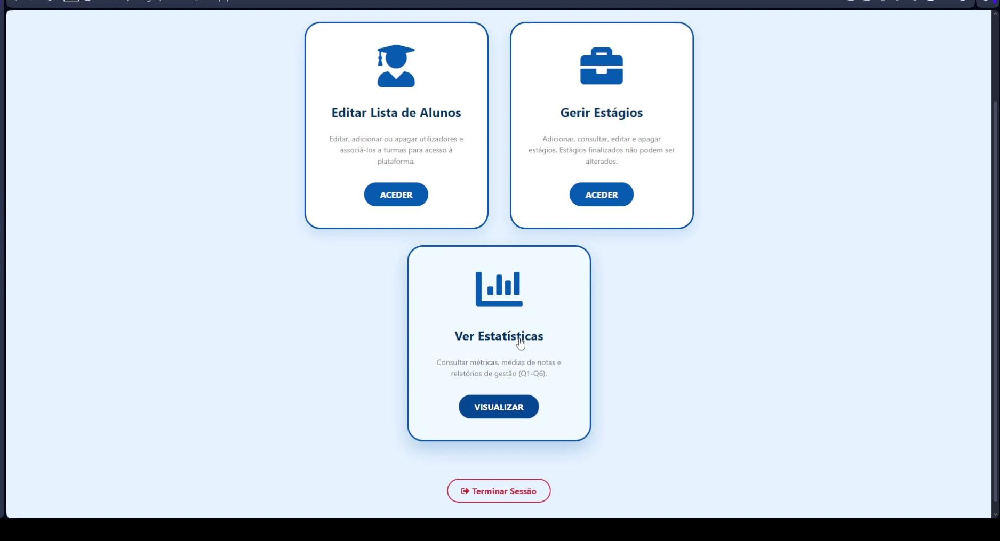
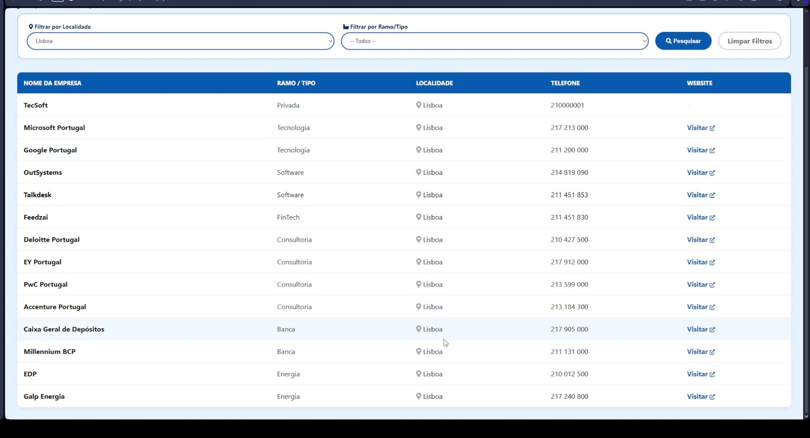
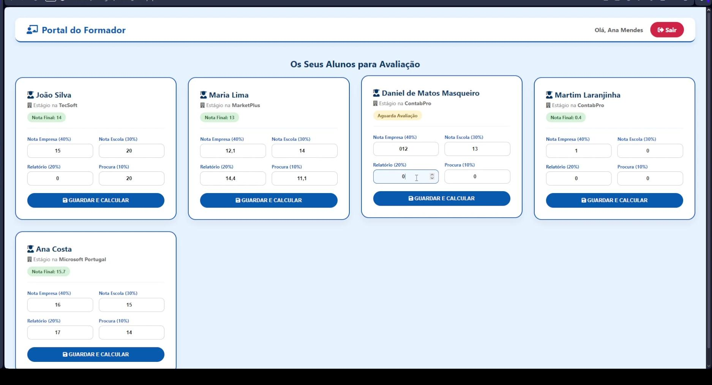
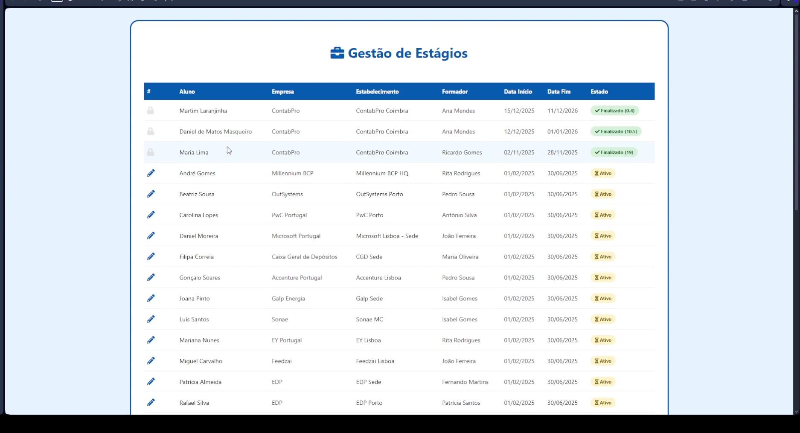
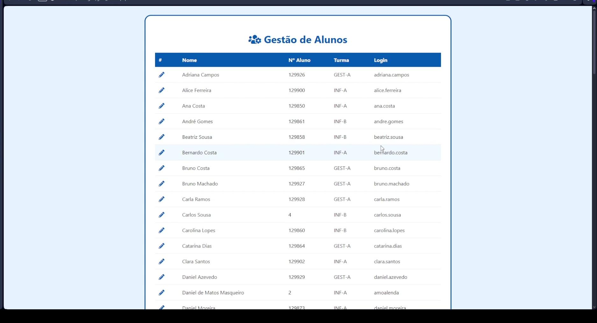

# SIEstágios - Internship Management System

>Modeling and implementation of a relational database for managing internships at a vocational school—ranging from the UML class diagram to a functional web prototype in PHP, and incorporating triggers, stored procedures, functions, and views that enforce business rules at the database engine level.
>
> *Two-part academic database project: UML modeling → relational schema → MySQL automation (triggers/procedures/functions/views) → a working PHP prototype with three portals.*

---

## Context

Project for the course unit unidade curricular de **Data Bases**, developed by Gonçalo Sobral, Daniel Masqueiro e Rafael Silva.

The assignment asked for an information system to manage curricular internships at a vocational school: student applications for company internships, monitoring by instructors, evaluation by both the school and the company, and management of openings by academic year. The project involved two deliverables:

- **Part 1 - Modeling e schema:** class diagram UML, passage for a realtional scheme, manual refinement  (types and keys), and first triggers.
- **Part 2 - Automations and prototype:** more triggers, stored procedures, SQL functions, analytical queries, views, and a web app in with 3 different portals (Admin, Trainer, Student) demonstrating the system working under the Data Base.

## What This Project Demonstrates

- Data modeling from a natural-language specification (entities, generalizations, compositions, aggregations, and associations, with their respective multiplicities).
- Translation of a UML class diagram into a normalized relational schema, including disjoint inheritance and composite keys.
- Critical analysis and refactoring of an auto-generated schema, with every decision justified.
- Business rules that cannot be enforced with foreign keys alone, implemented via triggers: disjoint hierarchies, cardinality limits, range validation, logical consistency between related entities, and derived values that stay always up to date.
- Stored procedures and SQL functions for reusable logic (validated internship registration, weighted grade calculation, aggregated averages).
- Analytical queries (aggregations, correlated subqueries, `HAVING` over averages) and views that consolidate those queries for direct consumption by the application.
- A real PHP application connected to the database using **prepared statements**, role-based session management, trigger/constraint error handling translated into readable messages, and three distinct portals.
- Real-world debugging of MySQL referential integrity errors, documented with root cause and fix (`#1553`, `#1025`, `#1834`, `#1048`, `#1064`, `SQLSTATE[23000]`).

## Class Diagram (UML)



## Relational Model (Part 1, after optimizations)



## Web Prototype (Part 2)

Three portals in PHP + MySQL: **Student** (browses companies with filters, views their own internship details), **Trainer/Supervisor** (submits grades, final grade automatically computed by a SQL function), **Admin** (student and internship management, Q1-Q6 statistics and V1/V2 views rendered in HTML).

| | |
|---|---|
|  |  |
|  |  |
|  |  |

## Implementation Highlights

**Part 1 - business rules in the base schema:**

| Business rule | Where it's implemented |
|---|---|
| A user can only be a student **or** a trainer **or** an admin | `database/triggers/03_disjoint_hierarquia_utilizador.sql` |
| Each class must have between 10 and 28 students | `database/triggers/01_turma_limites.sql` |
| School/company grades between 0-20; student's grade for the company between 1-5 | `database/triggers/02_notas_validacao.sql` |
| An internship's supervisor must belong to the correct establishment | `database/triggers/04_responsavel_estabelecimento_coerencia.sql` |
| Final internship grade calculated automatically | `database/triggers/05_nota_final_automatica.sql` |
| Establishment rating average per academic year, always up to date | `database/triggers/06_media_estabelecimento_automatica.sql` + `database/procedures/sp_atualizar_media_estabelecimento.sql` |

**Part 2 - automation and data access:**

| Automation | What it does |
|---|---|
| `t1_classificacao_insert` / `_update` | Student's rating of the establishment between 1 and 5 |
| `t2_data_fim_data_inicio_insert` / `_update` | `start_date` cannot be later than `end_date` |
| `p1_registar_estagio` (procedure) | Validates that the student/trainer/establishment exist before inserting an internship |
| `p2_next_estagios` (procedure) | Lists internships starting within the next N days |
| `f1_calculo_media_estabelecimentos` (function) | Average rating of an establishment for a given academic year |
| `f2_calculo_nota_final` (function) | Weighted final grade, with configurable weights per call |
| `v1_detalhes_formadores` / `v2_media_empresa_curso` (views) | Consolidate the analytical queries for direct use by the app |

## Repository Structure
```
SIEstagios/
├── README.md
├── docs/
│ ├── relatorio_projeto.pdf # Part 1 report
│ ├── relatorio_parte2.pdf # Part 2 report
│ └── images/
│ ├── diagrama_classes.png #class diagram
│ ├── modelo_relacional_final.png #relational diagram
│ └── prototipo_web/ # Prototype screenshots (extracted from the demo video)
├── database/
│ ├── README.md # Part 1 execution order
│ ├── schema/ # Part 1 DDL (table and FK creation)
│ ├── triggers/ # Part 1 business rules, one per file/topic
│ ├── procedures/ # Part 1 stored procedure
│ └── parte2/
│ ├── README.md # Part 2 schema details and consistency notes
│ ├── estagios_parte2_dump_completo.sql # Full dump: schema + seed + procedures/functions/triggers/views
│ └── consultas/
│ ├── queries.sql # Q1 to Q6
│ └── views.sql # V1 and V2
├── webapp/
│ ├── README.md # How to run the prototype locally
│ ├── index.php, Home.html, db.php
│ └── *.php # The three portals (student / trainer / admin)
└── modeling/
├── xmi/ # UML export in XMI format
└── bouml_project/ # Original BOUML project
```


## Stack

- **Modeling:** UML (class diagram) with [BOUML](https://www.bouml.fr/)
- **Database:** MySQL / MariaDB, triggers, stored procedures, functions, views
- **Backend:** PHP (mysqli, prepared statements)
- **Frontend:** Vanilla HTML/CSS + Font Awesome

## How to Try It

**Part 1 - base schema and business rules only:**
```bash
mysql -u <user> -p <database> < database/schema/01_schema_gerado_umltorel.sql
mysql -u <user> -p <database> < database/procedures/sp_atualizar_media_estabelecimento.sql
for f in database/triggers/*.sql; do
  mysql -u <user> -p <database> < "$f"
done
```

**Part 2 - full database with sample data + web prototype:**
```bash
mysql -u root -p -e "CREATE DATABASE estagios_parte2"
mysql -u root -p estagios_parte2 < database/parte2/estagios_parte2_dump_completo.sql
```
Then follow `webapp/README.md` to get the app running (XAMPP/WAMP/MAMP) and the test accounts.

## Known Limitations

Documented transparently in the reports:

- **Part 1:** phone numbers stored as `INT` (no support for international dialing codes); no date validation in the base schema; the fully optimized schema script (refined types/constraints) isn't included yet as a standalone `.sql` file - only documented in the report's data dictionary.
- **Part 2:** trainers can't be created through the interface (SQL only); `T2` doesn't validate whether dates fall within the academic calendar; a few fatal errors identified late in development weren't fixed in time; the Part 2 schema diverged in naming/structure from the Part 1 optimized schema (see `database/parte2/README.md`).
- **Reports** The reports are in portuguese and haven't been translated yet

## License

Academic project, made available for demonstration/portfolio purposes.
